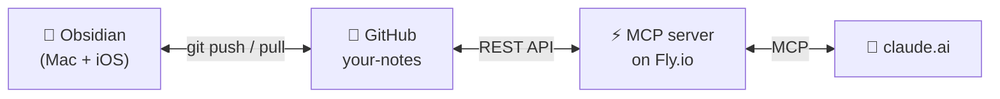

# Claude Meets Obsidian

Give Claude a key to your Obsidian vault.

## Why

I take notes in Obsidian. Claude is the best writing partner I've found. But the two don't talk to each other — I was constantly copy-pasting between them.

This fixes that. Notes live in a GitHub repo. Obsidian edits them locally and syncs via git. A small MCP server lets Claude read and write the same files. Now I can say "Claude, clean up my standup notes from this week" and it actually does — no copy, no paste, no upload.

It works on iPhone too, because Obsidian and claude.ai both do.

## How it works



GitHub is the source of truth. You write through Obsidian. Claude writes through the MCP server. Everyone's reading and writing the same files.

Four tools Claude can call:

| Tool | What it does |
|---|---|
| `list_notes(folder?)` | List all markdown files, optionally filtered |
| `read_note(path)` | Read a note's content |
| `write_note(path, content, message?)` | Create or update a note |
| `search_notes(query)` | Case-insensitive search across all notes |

Every write is a git commit, so you have full history and can roll anything back.

---

## Setup

You'll need: a GitHub account, [flyctl](https://fly.io/docs/hands-on/install-flyctl/), and Obsidian.

### 1. Make a notes repo

Create an empty private repo on GitHub — e.g. `youruser/notes`. This is where your notes will live.

### 2. Make a GitHub PAT

github.com/settings/tokens → **Generate new token (classic)** → check **`repo`** → generate and copy. You'll use it twice: once for the server, once for Obsidian.

### 3. Deploy the server

```bash
git clone https://github.com/markmace/mcp-note-server
cd mcp-note-server
fly launch          # accept defaults, decline deploy-now

fly secrets set \
  MCP_TOKEN=$(openssl rand -hex 32) \
  GITHUB_TOKEN=ghp_your_pat_here \
  GITHUB_REPO=youruser/notes

fly deploy
```

Note the `MCP_TOKEN` value — you'll need it for the connector URL.

### 4. Connect Claude

In claude.ai: **Settings → Connectors → Add custom connector**

URL: `https://<your-app>.fly.dev/mcp/<your-MCP_TOKEN>`

Ask Claude "list my notes" — should come back empty since you haven't made any yet.

### 5. Obsidian on Mac

```bash
git clone https://github.com/youruser/notes ~/notes
gh auth setup-git   # lets git use the gh CLI for HTTPS auth
```

In Obsidian: **Open folder as vault** → pick `~/notes`. Then install the **Git** plugin by Vinzent03 (Settings → Community plugins) and configure:

| Setting | Value |
|---|---|
| Auto commit-and-sync interval | `5` minutes |
| Auto commit-and-sync after stopping file edits | ✅ on |
| Pull on startup | ✅ on (default) |
| Auto pull interval | `0` (off) |

Add a `.gitignore` at the vault root:

```
.obsidian/workspace.json
.obsidian/workspace-mobile.json
.obsidian/plugins/obsidian-git/data.json
.trash/
```

That last line matters — it's where the iOS plugin stores your PAT.

Then commit your `.obsidian/` config so iOS picks up the plugin automatically:

```bash
git -C ~/notes add .obsidian/ .gitignore
git -C ~/notes commit -m "Obsidian config"
git -C ~/notes push
```

**Optional:** move any `README.md` in your notes repo into `.github/README.md` — GitHub still renders it on the repo page, but Obsidian hides dot-folders, so it won't clutter your vault.

### 6. Obsidian on iOS

This one has sharper edges. Read the whole step before tapping anything.

1. Install Obsidian, create a new **empty** vault
2. **Settings → Community plugins → Turn on** → install **Git** by Vinzent03 → enable
3. **Settings → Git → Authentication/Commit Author** — enter your GitHub username and PAT. **This must happen before the clone**, not during. The iOS plugin won't prompt mid-clone.
4. Open the command palette (swipe down on the note area) → **"Clone an existing remote repo"**
5. URL: `https://github.com/youruser/notes` — double-check for typos, most failures are this
6. Vault root: leave blank
7. "Contains a `.obsidian` folder?" → **Yes**
8. "Avoid conflicts..." → **Delete all your local config and plugins** (vault's empty anyway)
9. After the clone finishes, **close and reopen Obsidian** — a spurious error mid-clone goes away after restart

iOS doesn't background-sync. Before you put your phone down, swipe down → **"Git: Commit all changes and sync"** to push.

---

## Daily use

Edit in Obsidian like normal. Ask Claude things like:

- "Clean up my standup notes from this week"
- "Search my notes for anything I wrote about the migration"
- "Add today's meeting notes to `work/standup.md`"
- "What's in my ideas folder?"

Claude's edits show up in Obsidian within ~5 min (or pull manually).

## Local development

```bash
uv sync
export MCP_TOKEN=dev GITHUB_TOKEN=ghp_... GITHUB_REPO=youruser/notes
uv run uvicorn main:app --reload
```

## File layout

```
main.py        — FastAPI + ASGI middleware (token auth, CORS, path rewriting)
mcp_server.py  — the 4 MCP tools
github_api.py  — thin GitHub Contents API client
auth.py        — constant-time token comparison
Dockerfile
fly.toml
```

## Cost

Fly.io's free tier covers this — 256MB RAM, shared CPU, auto-stops when idle. GitHub API calls are well under the 5000/hour limit. Runs for $0/month for personal use.

## License

MIT — do whatever you want with it.
